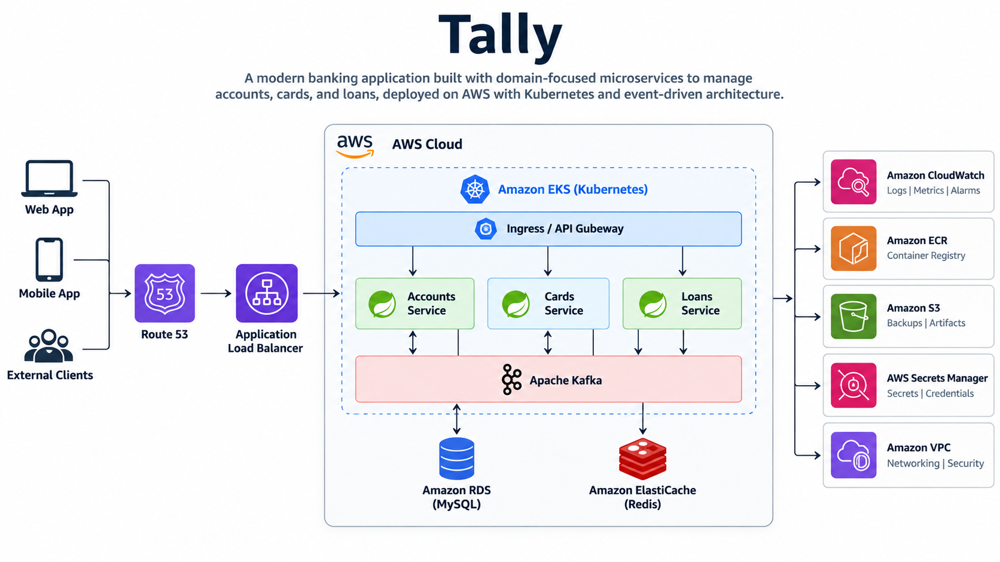

# Tally

Tally is a **banking application built using domain-focused microservices**. The system is designed to manage core banking domains such as accounts, cards, and loans, with each domain implemented as an independent Spring Boot service.

The project is being developed with a production-oriented architecture using **event-driven communication, caching, containerization, Kubernetes, and AWS**.



## Services

* **Accounts Service** — Manages customer bank accounts.
* **Cards Service** — Manages banking cards.
* **Loans Service** — Manages loans and related operations.

Each service is independently developed, tested, and deployed.

## Technology Stack

### Backend

* Java 25
* Spring Boot 4.1.1
* Spring MVC
* Spring Data JPA
* Spring Validation
* Lombok

### Database & Caching

* MySQL — Persistent storage
* Redis — Caching

### Communication

* REST APIs — Synchronous communication
* Apache Kafka — Event-driven asynchronous communication

### DevOps & Infrastructure

* Docker — Containerization
* Kubernetes — Container orchestration
* AWS — Cloud deployment and infrastructure

### API & Monitoring

* OpenAPI / Swagger — API documentation
* Spring Boot Actuator — Application monitoring

### Build & Testing

* Maven
* JUnit / Spring Boot Test

## Architecture

```text
                    Clients
                       |
                 API Gateway
                       |
        +--------------+--------------+
        |              |              |
   Accounts         Cards          Loans
   Service         Service         Service
        |              |              |
        +--------------+--------------+
                       |
                     Kafka
                       |
                  Event Flow
                       |
              +--------+--------+
              |                 |
            MySQL             Redis
```

The services are designed to maintain **clear domain ownership**, while Kafka enables asynchronous communication between services. MySQL provides persistent storage and Redis is used for caching where required.

## Current Status

Currently, the project contains:

* Accounts, Cards, and Loans Spring Boot services
* REST APIs
* Spring Data JPA
* H2 databases for local development
* Basic validation and testing
* OpenAPI documentation
* Actuator monitoring

The production infrastructure involving **MySQL, Redis, Kafka, Docker, Kubernetes, and AWS** will be added as the project evolves.
